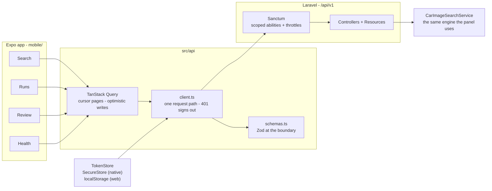

# Cars Images API

A Laravel 13 + Filament 5 application that searches, filters, reviews, and bulk-exports car photography from **Wikimedia Commons** — one vehicle at a time, or thousands of rows from a CSV.

A versioned **`/api/v1` JSON API** and an **Expo (React Native) client** put the same pipeline on a phone and in the browser: run a search, browse a run, work a review queue, and read pipeline health without opening the admin panel.


[](https://github.com/RonaldAllanRivera/cars-images-api/actions/workflows/ci-cd.yml)
[](https://github.com/RonaldAllanRivera/cars-images-api/actions/workflows/mobile.yml)


---

## Contents

- [Overview](#overview)
- [How it works](#how-it-works)
- [Features](#features)
- [JSON API](#json-api)
- [Mobile client](#mobile-client)
- [Engineering notes](#engineering-notes)
- [Tech stack](#tech-stack)
- [Getting started with Docker](#getting-started-with-docker)
- [Getting started without Docker](#getting-started-without-docker)
- [Configuration](#configuration)
- [Usage](#usage)
- [Testing](#testing)
- [Deployment](#deployment)
- [Project structure](#project-structure)
- [Roadmap](#roadmap)
- [License](#license)

---

## Overview

Sourcing usable photos for a large vehicle catalogue is tedious: every make/model/year needs its own search, Wikimedia's full-text index is inconsistent, results are frequently mis-filed or not cars at all, and the originals are far too large to ship to a website.

This application turns that into a reviewable pipeline:

1. **Import** a vehicle list (CSV) or run a single ad-hoc search.
2. **Harvest** images from Wikimedia Commons at a rate the API is happy with.
3. **Review** what came back, with off-target results flagged rather than silently trusted.
4. **Export** the approved set as a web-optimized ZIP plus a matching CSV manifest.

Every stage is inspectable in the admin panel, and nothing is thrown away without a human deciding. Since the JSON API landed, the same review work can be done from the Expo client on a phone.

---

## How it works


The two entry points share one engine. An **ad-hoc search** (`car_searches` with a null `csv_import_id`) and a **CSV-imported query** (`csv_import_id` set) are the same row type, scoped apart at the resource level, and both flow through `CarImageSearchService`.

---

## Features

### Search and harvesting

- Query Wikimedia Commons by **make, model, year range, color, transmission**, and transparent background — one API request per year in the range.
- **Linked make/model dropdowns** driven by a curated catalogue, with `All models` / `All colors` / `All transmissions` options to widen a search.
- **Result caching and reuse.** Searches persist to `car_searches`; an identical completed search reuses its stored images instead of calling Wikimedia again.
- **Year-relaxation fallback.** When a year-specific query returns nothing, it retries once without the year, so sparsely documented models still return results.
- **Non-car and non-image filtering.** Wikimedia's `File:` namespace also holds PDFs, DjVu documents, botanical photos and journal figures; these are dropped by MIME type and by a title/description/category heuristic.

### Review

- **Off-make rejection, then flagging.** Wikimedia's full-text search matches loosely — querying an `Acura CL` returns `Honda Accord CL3` photographs, because the Accord's chassis code contains the model token. Images that plainly name a *different* manufacturer are therefore rejected outright and never stored. What survives is recorded as **Confirmed / Not confirmed** against the searched make and shown as a badge with a filter, so genuinely ambiguous results still reach a human rather than being silently trusted.
- **Badge engineering is preserved.** Some Acuras are legitimately catalogued by Wikimedia under Honda. A page naming *both* makes is kept, because it really is the searched car.
- **A human verdict recorded beside the machine's.** `review_status` (approve / reject) is a separate column from `make_confirmed` and `year_confirmed`, so a reviewer's judgement and `MakeRelevanceChecker`'s stay comparable rather than overwriting one another. Both show on the Results table, and the mobile Review tab works the queue of images no human has ruled on yet.
- Sortable, searchable tables with thumbnails, live-polling status badges, preview modals, and per-row or bulk delete.

### Export

- **Download Selected as ZIP** — every selected image, resized and renamed.
- **Download Confirmed as ZIP** — the same, narrowed to make-confirmed images only.
- **Export Selected as CSV** — a manifest whose `Filename` column matches the ZIP entries exactly, so the archive and the spreadsheet never drift apart.
- Filenames are deterministic and filesystem-safe: `1997 Toyota RAV4.jpg`, with duplicates suffixed `1997 Toyota RAV4 2.jpg`.

### Administration

- Dedicated **Car Makes** catalogue (makes with a models repeater) that feeds the search dropdowns.
- **Admin Users** management with hashed passwords and blank-to-keep password editing.
- Wikimedia block events recorded and visible, rather than failing silently.
- **A pipeline error log.** `error_events` records why a CSV upload, an individual row, a search run, an image download or a Wikimedia block failed, with a retention window, a per-import ceiling so one bad upload cannot write thousands of rows, and an `error-events:prune` command (nothing prunes on a schedule — there is no cron on shared hosting).
- **Pipeline health on the landing page** — an overview widget, a search-throughput chart, an errors-by-context chart, and a latest-failures table.

---

## JSON API

A versioned JSON API under `/api/v1` exposes the pipeline to clients other than the admin panel. It is what the Expo app talks to, and it is versioned from its first commit — a breaking change ships as `/v2` beside it rather than in place.

**Authentication** is a Sanctum bearer token. `POST /auth/login` exchanges credentials for a token carrying four scoped abilities:

| Ability | Grants |
| --- | --- |
| `search:read` | list and show images, searches, and a search's images |
| `search:write` | run an ad-hoc search |
| `review:write` | record an approve / reject verdict |
| `errors:read` | pipeline health summary and the error log |

The abilities are constants, so a typo in a route is a fatal error rather than a silent 403.

| Method | Route | Notes |
| --- | --- | --- |
| `POST` | `/auth/login` | 5 req/min — the only route the open internet reaches |
| `POST` | `/auth/logout` | revokes the calling token |
| `GET` | `/auth/me` | the authenticated user |
| `GET` | `/images`, `/images/{image}` | cursor-paginated, filterable |
| `GET` | `/searches`, `/searches/{search}` | search runs |
| `GET` | `/searches/{search}/images` | a run's images |
| `POST` | `/searches` | 10 req/min — runs the search inline |
| `PATCH` | `/images/{image}/review` | the human verdict |
| `GET` | `/health/summary`, `/errors` | pipeline health and failures |

Three details are worth knowing before building against it:

**Every rate limit is named on its route**, not inherited from the middleware group. Login is the tightest at 5/min because it is unauthenticated; `POST /searches` is next at 10/min because it reaches Wikimedia, which has blocked this application before.

**`POST /searches` is capped tighter than the admin panel.** There is no queue worker on shared hosting, so the search runs inside the HTTP request and has to finish inside `max_execution_time`. `API_SEARCH_MAX_YEAR_SPAN` (3) and `API_SEARCH_MAX_IMAGES_PER_YEAR` (5) bound what one call may ask for; a search too large for the API is still available from the panel. It answers `201`, `200`, `503` or `502` with a real search row in every case — a `503` means Wikimedia blocked the run, and the row records that.

**CORS allows only the configured browser origin.** `CORS_ALLOWED_ORIGINS` is empty by default. The web build of the mobile app is the only browser that should reach `api/*`; the native build sends no `Origin` header and is unaffected. **If the deployed web origin is not listed there, the browser blocks every request and sign-in fails silently.**

---

## Mobile client

An Expo app under [`mobile/`](mobile/) — four tabs, TypeScript throughout, talking to `/api/v1`.

| Tab | What it does |
| --- | --- |
| **Search** | run an ad-hoc search against Wikimedia and page through the results |
| **Runs** | browse past search runs and open a run's images |
| **Review** | work the queue of images no human has ruled on, approving or rejecting |
| **Health** | the pipeline health summary and the error log |



It ships two ways from one codebase:

- **Web:** built by [`.github/workflows/mobile.yml`](.github/workflows/mobile.yml) and published to Netlify on every push to `main` that touches `mobile/**`.
- **Android APK:** planned, tag-triggered (see the design doc).

### Local development

```bash
cd mobile
npm install
cp .env.example .env      # point EXPO_PUBLIC_API_URL at your Laravel dev server
npm run web               # or: npm start, npm run android
```

```bash
npm run typecheck   # tsc --noEmit
npm run lint
npm test            # 60 tests, 13 suites
npm run build:web   # expo export -p web  ->  dist/
```

`mobile/` keeps its own `package.json` and lockfile, separate from the root one that builds Laravel's Vite assets. That separation is deliberate — it is what stops Metro resolving the repository root's `node_modules`.

> **After changing `EXPO_PUBLIC_API_URL`, export with `--clear`.** Metro's cache is not keyed on `EXPO_PUBLIC_` values, so a warm cache will happily serve a bundle carrying the previous run's URL — and a verification step that greps the emitted bundle will report a false PASS.

### How it is put together

**The token store is one interface with two implementations.** `expo-secure-store` on native, `localStorage` on web, selected by `Platform.OS`. Every web call is wrapped in try/catch, because a browser in private mode can *throw* on storage access rather than return empty — a missing token means "signed out", which is recoverable; an exception at module load is not. A bearer token in `localStorage` is a genuine exposure, and the mitigation is named rather than waved away: token abilities are scoped, so a stolen web token can do only what the API let it do.

**One request path, and one place a session ends.** A private `send()` builds the URL, attaches the bearer header and reads the body once, so the "a 204 has no JSON to parse" case is handled once instead of in every caller. A `401` signs the user out from that single function. A `403` deliberately does **not** — the token is alive and merely lacks an ability, and treating the two alike would log a reviewer out for opening a screen they were never granted.

**Zod runs at the boundary, not at the point of use.** Every response is parsed against a schema, so drift between a PHP `Resource` and the client contract throws at the fetch, naming the field that moved, rather than surfacing as `undefined is not an object` three screens later.

**The contract is pinned in both languages.** `tests/Feature/Api/ContractFixturesTest.php` captures real responses into `mobile/src/api/__fixtures__/*.json` and fails when the committed copies drift; the mobile suite then asserts its Zod schemas against those same files. A renamed field is a red PHP run *and* a red TypeScript run. Regenerate deliberately:

```bash
UPDATE_CONTRACT_FIXTURES=1 php artisan test --filter=ContractFixturesTest
```

The capture freezes the clock and normalises the token to a placeholder, so a fixture diff always means a real change and nothing credential-shaped is committed.

**Approve and reject are optimistic, with a real undo.** The verdict is written into every cache that could hold the row and a snapshot is restored if the request fails — an optimistic update that cannot undo itself leaves the UI asserting something the server never accepted. The cache predicate matches `queryKey[0] === 'images' || queryKey[2] === 'images'` rather than a plain `['images']` prefix, because a run's own image list is keyed `['searches', id, 'images', filters]`; a prefix filter would leave a stale badge on exactly the screen the reviewer was looking at.

**Auth is a route guard, not a per-screen check.** `app/(app)/_layout.tsx` redirects to `/login` while the status is `anonymous` and renders a spinner while it is `loading`. That loading branch carries its own `<PageTitle>`, because the static export renders precisely that branch into every guarded route's HTML — whether a session exists is only knowable in the browser — so without it those pages would ship with a blank browser tab.

### Web deployment

The build runs in GitHub Actions, **not** on Netlify, and the Git repository is deliberately not linked to the Netlify site: one build of record rather than two that can disagree. The workflow typechecks, lints, tests and exports on every push and pull request touching `mobile/**`, then publishes `dist/` with the Netlify CLI when `MOBILE_DEPLOY_ENABLED` is `true`.

Two things in [`mobile/netlify.toml`](mobile/netlify.toml) are worth reading before editing it:

- **The rewrites are specific, not a catch-all.** A static export keeps Expo Router's filename verbatim, so `/runs/42` lives on disk as `dist/runs/[id].html` and a shared link would otherwise 404. Three ordered 200-rewrites map them (`/runs/image/:id` before `/runs/:id` — the more specific pattern has to match first). Because they are not a catch-all, an existing file still wins and a genuinely unknown path still 404s instead of being handed an app shell.
- **The CSP pins a script hash instead of allowing `'unsafe-inline'`.** The export emits exactly one inline script — the stable one-liner `globalThis.__EXPO_ROUTER_HYDRATE__=true;` — so it is hashed and every other inline script stays blocked. If a future Expo version changes that snippet the hash goes stale and the page client-renders instead of hydrating; recompute it from the emitted HTML rather than reaching for `'unsafe-inline'`.

`EXPO_PUBLIC_API_URL` is inlined into the bundle at build time — there is no runtime config file, so a deployed build cannot be pointed at the wrong backend by accident, and changing the variable requires a rebuild. That is why the deploy job accepts `workflow_dispatch`: no push touches `mobile/**` just because the API moved, and without a manual trigger the only way to republish would be an empty commit.

> Set `EXPO_PUBLIC_API_URL` as a repository **variable**, not a secret. An unset `vars.*` renders as an empty string, the client reads it with `??` (which does not treat `""` as absent), and `new URL(path, "")` then throws on every request — a green deploy shipping a site where nothing loads. The export step now fails on an empty value rather than let that through.

**Setting Netlify up for the first time, or debugging a deploy?** See [`docs/netlify-deploy.md`](docs/netlify-deploy.md) — it covers the one-time setup, why the repository is deliberately not linked, and the specific failure modes worth recognising: **a blank page means the CSP, a silent sign-in failure means CORS.**

---

## Engineering notes

The parts of this project worth reading are the ones that exist because the obvious approach did not survive contact with the real API.

**Wikimedia rate-limit etiquette is built in, not bolted on.** Requests send a descriptive, contactable `User-Agent` (Wikimedia's UA policy rejects generic ones with 429/403), set `maxlag=5` so the app backs off when replication lags, cache for 24 hours, pause one second between bulk queries, and retry transient failures with exponential backoff. A 429/403/503 raises a typed `WikimediaBlockedException`, is persisted to `wikimedia_block_events`, and **halts the bulk loop** — the failure mode of a harvesting tool should never be to keep hammering.

**Thumbnails are generated locally because the CDN refuses.** The first implementation requested Wikimedia's `/thumb/` URLs. Those return HTTP 400 when requested from datacenter and shared-hosting IPs, so it worked in development and failed in production. The fix was to download the original and resize with GD (`ImageResizer`, default 1600px max width, JPEG re-encode) — roughly an 85% size reduction, and host-independent. Unsupported formats fall through with the original bytes intact, so an image is never lost from an archive.

**CSV model strings are normalized before querying.** Vehicle data encodes models as engine displacement plus trim (`2.2CL/3.0CL`); Wikimedia catalogues the bare model (`CL`). `ModelSearchTermNormalizer` strips the displacement prefix and collapses slash-separated variants, but keeps the original whenever stripping would leave too little to search on.

**Transmission is deliberately dropped from CSV-driven queries.** Image pages never say "Automatic 4-spd", so including it returned zero results across the board. It is kept as manifest metadata; ad-hoc searches, where the user typed it on purpose, still use it.

**Off-make results are flagged, not filtered.** Badge-engineered and region-specific models are catalogued under a different marque — an Acura CL is filed as a Honda Accord. Auto-rejecting those would throw away correct photographs of the right car; auto-accepting them hides a real data quirk. `MakeRelevanceChecker` marks the discrepancy and lets the reviewer decide.

**Synchronous work is capped rather than left to time out.** Bulk runs stop at 50 queries or 50 seconds per click and bulk ZIPs at 100 images, because both are built inside a single web request on shared hosting. Each cap is a config value with an explicit reason in `config/cars-images.php`, and the UI tells the user to click again rather than dying at the gateway timeout.

**Failure paths are explicit.** A per-image fetch failure skips that image instead of aborting the archive; an archive where everything failed reports it instead of serving a zero-entry ZIP; a search that throws is forced to `failed` even though its status update was inside the rolled-back transaction. A refresh deletes and refetches inside **one** transaction, so a rate-limited Wikimedia cannot leave a search stripped of the images it was replacing.

**One image can belong to many searches.** The same Commons file legitimately answers several queries, so ownership — `(car_search_id, year, provider, provider_image_id)` — is part of the upsert key and is enforced by a unique index. Keyed only on the file, a later search would *move* the row instead of copying it, silently emptying the earlier search.

**The API and its client are pinned to each other, not trusted to agree.** The usual way a backend and a mobile client drift apart is quietly: a field is renamed in a serializer, the client renders a blank, and nobody notices until a user reports it. Here the PHP suite *generates* the JSON fixtures the Expo app's Zod schemas are asserted against, so the rename fails the PHP suite first and then names the moved field in the TypeScript one. The cost is a deliberate regeneration step; the benefit is that contract drift cannot reach production silently.

**The API's limits are tighter than the panel's, on purpose.** `POST /searches` runs its search inside the HTTP request, because there is no queue worker on shared hosting — so it caps the year span at 3 and images-per-year at 5, where the panel allows far more. A search too large for the API is not refused work; it is redirected to the surface that can afford it.

**A cap on queries is not a cap on cost.** The CSV importer has always bounded the number of *queries* an upload can produce, which says nothing about the number of *images* those queries then download. At the defaults that is 1,000 × 5 = 5,000 downloads, paced at a second apiece. `CSV_IMPORT_MAX_PROJECTED_IMAGES` defaults to exactly the product of the two caps above it — so out of the box it rejects nothing the old cap allowed — but raising images-per-year is now caught at upload time instead of part-way through a long run.

---

## Tech stack

| Layer | Choice |
| --- | --- |
| Runtime | PHP 8.3+ (`ext-gd`, `ext-zip`, `ext-intl`, `ext-pdo_mysql`) |
| Framework | Laravel 13.x |
| Admin UI | Filament 5.x (Livewire 4) |
| Database | MySQL 8.0 |
| External API | MediaWiki / Wikimedia Commons |
| Image processing | GD |
| Local environment | Docker (Apache + mod_php + MySQL) |
| Tests | PHPUnit 12 (requires `ext-pdo_sqlite`) |
| API auth | Laravel Sanctum (bearer tokens, scoped abilities) |
| Mobile | Expo SDK 57, Expo Router 57, React Native 0.86, React 19.2 |
| Mobile data | TanStack Query 5, Zod 4 |
| Mobile styling | NativeWind 4 (Tailwind 3) |
| Mobile tests | Jest 29 + `@testing-library/react-native` |
| Web hosting (app) | Netlify, static export published from GitHub Actions |

> **Currently on the latest release of every major dependency** — Laravel 13.26, Filament 5.7, Livewire 4.4, PHPUnit 12. The upgrade was executed in verified stages; the plan, compatibility matrix, per-stage gates, and the issues it surfaced are recorded in [`docs/upgrades/2026-08-24-laravel-13-filament-5-upgrade.md`](docs/upgrades/2026-08-24-laravel-13-filament-5-upgrade.md).

---

## Getting started with Docker

The Docker stack mirrors SiteGround shared hosting — Apache + mod_php + MySQL, with `file` cache/session and a `sync` queue — so routing and `.htaccess` problems surface locally instead of after deployment.

**Prerequisites:** Docker Engine 24+ and Docker Compose v2.

```bash
cp .env.example .env
# The defaults work as-is for Docker. Before harvesting, set WIKIMEDIA_USER_AGENT
# to a string identifying your deployment with a real contact address.
docker compose build
docker compose up -d
docker compose exec app composer install
docker compose exec app php artisan key:generate
docker compose exec app php artisan migrate --seed
docker compose exec app php artisan storage:link
```

The panel is then at `http://localhost:8080/admin` — change `APP_PORT` in `.env` to use a different host port.

**Notes**

- `docker compose down` keeps the `cars-mysql-data` volume; `docker compose down -v` wipes the database.
- The `app` container runs as UID/GID 1000 — override with the `WWWUSER` / `WWWGROUP` build args if your host user differs.
- Re-run `docker compose exec app composer install` after pulling changes to `composer.json` / `composer.lock`.
- MySQL is published on `${FORWARD_DB_PORT}` (default `3307`) if you want to attach a GUI client.

---

## Getting started without Docker

**Prerequisites:** PHP 8.3+ with `gd`, `zip`, `intl`, `pdo_mysql` (plus `pdo_sqlite` to run the tests), Composer, MySQL 8, and Node.js only if you intend to rebuild frontend assets.

```bash
git clone <YOUR_REPO_URL> cars-images-api
cd cars-images-api

composer install
cp .env.example .env          # set DB_HOST=127.0.0.1 and the DB_* values for your machine
php artisan key:generate
php artisan migrate --seed
php artisan storage:link
php artisan serve             # or point Laragon / Valet / nginx at public/
```

`migrate --seed` creates the Filament admin user and seeds the default make/model catalogue used by the search form.

> **Change the seeded admin password before exposing the panel.** `FilamentAdminUserSeeder` creates its account from credentials committed to this repository, and because it uses `updateOrCreate`, re-running the seeder resets that password back to the committed value.

---

## Configuration

Wikimedia integration lives in `config/images.php`; all application limits live in `config/cars-images.php`. Both are environment-driven.

| Variable | Default | Purpose |
| --- | --- | --- |
| `WIKIMEDIA_BASE_URL` | `https://commons.wikimedia.org/w/api.php` | MediaWiki API endpoint |
| `WIKIMEDIA_USER_AGENT` | — | **Set this to a real, contactable UA.** Wikimedia blocks generic agents |
| `WIKIMEDIA_TIMEOUT` | `10` | Per-request timeout (seconds) |
| `WIKIMEDIA_RETRY_TIMES` | `3` | Retry attempts for transient errors |
| `WIKIMEDIA_RETRY_SLEEP_MS` | `200` | Backoff base; doubles per attempt |
| `WIKIMEDIA_CACHE_TTL` | `3600` | Search-result cache lifetime (seconds) |
| `WIKIMEDIA_MAXLAG` | `5` | MediaWiki `maxlag` courtesy parameter |
| `CSV_IMPORT_MAX_COMBOS` | `1000` | Reject an upload above this many unique queries |
| `CSV_IMPORT_DEFAULT_IMAGES_PER_YEAR` | `5` | Images requested per imported query |
| `CARS_BULK_RUN_MAX_QUERIES` | `50` | Queries per bulk-run click |
| `CARS_BULK_RUN_MAX_SECONDS` | `50` | Wall-clock ceiling per bulk-run click |
| `CARS_BULK_RUN_SLEEP_SECONDS` | `1` | Pause between bulk queries |
| `CARS_DOWNLOAD_MAX_WIDTH` | `1600` | Max width for ZIP images (resized locally) |
| `CARS_DOWNLOAD_JPEG_QUALITY` | `82` | JPEG quality for resized images |
| `CARS_BULK_DOWNLOAD_MAX_IMAGES` | `100` | Max images per synchronous ZIP |
| `CSV_IMPORT_MAX_UPLOAD_KB` | `5120` | Max size of an uploaded CSV |
| `CSV_IMPORT_MAX_PROJECTED_IMAGES` | `5000` | Reject an upload committing to more image downloads than this |
| `ERROR_LOG_RETENTION_DAYS` | `30` | How long a recorded failure is kept |
| `ERROR_LOG_MAX_EVENTS_PER_IMPORT` | `500` | Events stored per CSV import before suppression |
| `API_SEARCH_MAX_YEAR_SPAN` | `3` | Max year span for `POST /api/v1/searches` |
| `API_SEARCH_MAX_IMAGES_PER_YEAR` | `5` | Max images per year for `POST /api/v1/searches` |
| `CORS_ALLOWED_ORIGINS` | — | **Comma-separated browser origins allowed to call `api/*`.** Empty blocks every browser |

The Expo app is configured separately, in `mobile/.env`:

| Variable | Default | Purpose |
| --- | --- | --- |
| `EXPO_PUBLIC_API_URL` | `http://localhost:8000` | API origin, **inlined into the bundle at build time** |

---

## Usage

### CSV bulk pipeline

The three pages under the **Cars** navigation group run left to right.

**1. Upload CSV** (`/admin/csv-imports/create`)

Required columns are `Make`, `Model`, `Year`; `Transmission` is optional and carried through to the manifest. Rows are deduplicated by `(Year, Make, Model)`, rows with a missing field or an implausible year are skipped and counted, and an upload producing more than `CSV_IMPORT_MAX_COMBOS` unique queries is rejected outright rather than half-imported.

```csv
Make,Model,Year,Transmission
Toyota,RAV4,1997,Automatic 4-spd
Acura,2.2CL/3.0CL,1998,Manual 5-spd
```

**2. Search Queries** (`/admin/search-queries`)

Review the imported queries, then **Run** a single row or select many and **Run Selected**. Bulk runs process up to `CARS_BULK_RUN_MAX_QUERIES` queries or `CARS_BULK_RUN_MAX_SECONDS` seconds per click — click again to continue. A Wikimedia block pauses the run, raises a persistent notification, and records the event.

**3. Results** (`/admin/results`)

Browse the harvested images, filter by source CSV or by **Make match**, then export the selection as a ZIP, a confirmed-only ZIP, or a CSV manifest.

### Ad-hoc search

**Cars → Car Image Searches → Create.** Pick a make (the model list follows it), set a year range — reversed ranges are normalized — and optionally a color, transmission, or transparent-background toggle. The search runs synchronously and redirects to its view page, where the **Images** relation holds the results.

From that view page, **Refresh from Wikimedia** deletes the search's images, clears the cached responses for its years, and re-runs with the current filters. Editing the search instead re-runs it with the *new* filters.

### Catalogue and users

**Cars → Car Makes** manages makes and their models (used by the search dropdowns; built-in defaults apply when the tables are empty). **System → Admin Users** manages panel accounts — leave the password blank when editing to keep the existing one.

---

## Testing

```bash
php artisan test                        # whole suite
php artisan test --testsuite=Unit       # fast, no database
php artisan test --filter=BatchZipBuilder
```

267 tests across 48 files: 56 unit tests over the pure helpers (filename building, image resizing, make relevance and off-make rejection, model normalization) and 211 feature tests over the CSV importer, ZIP/CSV export, Wikimedia block handling and recall fallback, resource scoping, off-make filtering, the Results page bulk actions, the error-log instrumentation and its widgets, every `/api/v1` endpoint with its abilities and rate limits, a smoke test that mounts **every** page in the panel, the registered record/bulk actions on every table, the CSV upload driven through the Filament form itself, and the ad-hoc search form's `All ...` sentinel round-trip.

The last three exist as upgrade insurance, and they earned it: they carried this codebase through Laravel 12→13 and Filament 4→5 (Livewire 3→4) with no behavioural regressions. A major release typically breaks an application by renaming a builder method, which leaves the resource compiling but the page throwing on mount — `PanelSmokeTest` turns that into a failing test rather than a support ticket, and `TableActionsTest` catches the subtler case where a page still renders but has quietly lost its buttons.

> Feature tests run against an in-memory SQLite database (see `phpunit.xml`), so **`ext-pdo_sqlite` must be installed** — without it every database-backed test errors with `could not find driver` while the unit tests still pass.

`ContractFixturesTest` is not an ordinary test: it *generates* the JSON fixtures the mobile app's Zod schemas are asserted against, and fails when the committed copies no longer match what the API returns. A red run there means the API shape changed — regenerate, then run the mobile suite, and the Zod schemas will name the field that moved.

```bash
UPDATE_CONTRACT_FIXTURES=1 php artisan test --filter=ContractFixturesTest
```

The mobile app has its own suite — 60 tests across 13 files, covering the API client's error and 401 handling, the Zod schemas against those fixtures, the token store on both platforms, the auth context and route guard, the optimistic review mutation and its cache predicate, the infinite grid, and the search and health screens:

```bash
cd mobile
npm test            # jest
npm run typecheck   # tsc --noEmit
npm run lint
```

Code style is enforced with Pint:

```bash
./vendor/bin/pint --test    # check
./vendor/bin/pint           # fix
```

---

## Deployment

**Deployment is continuous.** Pushing to `main` runs the suite and, if it is green, deploys to SiteGround over SSH via [`.github/workflows/ci-cd.yml`](.github/workflows/ci-cd.yml) — no manual session required. The deploy job has `needs: test`, so a red suite never reaches production.

The interesting part is the failure behaviour rather than the happy path:

| Guard | What it prevents |
| --- | --- |
| `trap ... EXIT` around maintenance mode | a failed migration leaving the panel offline |
| Pinned `SSH_KNOWN_HOSTS` + `StrictHostKeyChecking=yes` | handing the deploy key to a hijacked hostname |
| `BatchMode` + `ConnectTimeout` | a credential prompt hanging the job until it times out |
| `concurrency` group | two deploys interleaving a `composer install` and a migration |
| `artisan` preflight on `DEPLOY_PATH` | `git reset --hard` running in the wrong directory |
| HTTP 200 smoke check on `/admin/login` | a deploy that 500s the site reporting success |
| Docs-only path filter | taking production offline to publish a changelog entry |

Each was verified by execution, not by reading: the script was run end-to-end against a throwaway clone, and the trap was proven with a deliberately broken migration — the run exits non-zero *and* the site comes back up.

`DEPLOYMENT.md` covers the rest: §6.1 the automated deploy and its secrets, §6.2 the manual SSH sequence as fallback, plus directory layout, serving Laravel from `public/`, the `.htaccess` rewrite that keeps Livewire's endpoint reachable, and troubleshooting. The Docker stack above deliberately mirrors that environment.

### The mobile pipeline is separate

[`.github/workflows/mobile.yml`](.github/workflows/mobile.yml) watches `mobile/**` only, and `ci-cd.yml` ignores it. A change to the Expo app therefore cannot cycle production through maintenance mode, and a change to the API cannot spend CI minutes building a Metro bundle. The app's job typechecks, lints, tests and exports on every push and pull request, then publishes `dist/` to Netlify from `main` when the repository variable `MOBILE_DEPLOY_ENABLED` is `true` — the same switch pattern as `DEPLOY_ENABLED`, so `main` could carry this code before the Netlify site existed.

`cancel-in-progress` is set for pull requests only. An outdated PR run is worth superseding; a run on `main` may be midway through publishing, and a cancelled deploy is worse than a slow one.

Setup and the failure modes are in [`docs/netlify-deploy.md`](docs/netlify-deploy.md).

---

## Project structure

```
app/
├── Auth/                TokenAbilities — what a bearer token is allowed to do
├── Console/Commands/    PruneErrorEvents (no cron on shared hosting; run by hand)
├── Exceptions/          WikimediaBlockedException — typed rate-limit signal
├── Filament/
│   ├── Pages/           Results (bulk export surface)
│   ├── Resources/       CsvImport, SearchQuery, CarSearch, CarImage, CarMake, ErrorEvent, User
│   └── Widgets/         PipelineHealthOverview, SearchThroughputChart, ErrorsByContextChart, LatestFailuresTable
├── Http/
│   ├── Controllers/     Single-image authenticated download endpoint
│   │   └── Api/V1/      Auth, Image, Search, ReviewImage, HealthSummary, Error
│   ├── Requests/Api/V1/ Validation and caps for every API entry point
│   └── Resources/Api/V1 The JSON shapes the mobile client is pinned to
├── Jobs/                Queue scaffolding (not dispatched yet — see Roadmap)
├── Models/              CarSearch, CarImage, CsvImport, CarMake, CarModel, ErrorEvent, WikimediaBlockEvent, User
├── Policies/            CarImagePolicy, CarSearchPolicy
└── Services/
    ├── Downloads/       BatchZipBuilder, BatchCsvExporter, ImageResizer, FilenameBuilder
    ├── Health/          PipelineHealthSummary — one source for the widget and the API
    ├── Images/          WikimediaClient, CarImageSearchService, MakeRelevanceChecker, ModelSearchTermNormalizer
    ├── Imports/         CsvQueryImporter
    ├── Logging/         ErrorEventLogger
    └── Search/          RunSearchQueryAction
config/
├── cars-images.php      Import caps, bulk-run pacing, download sizing, API caps, error log
├── cors.php             Which browser origins may call api/*
├── images.php           Wikimedia client settings
└── sanctum.php          Token auth
routes/api.php           /api/v1 — versioned from the first commit
mobile/                  The Expo app — its own package.json, lockfile and CI
├── app/                 Expo Router routes; (app)/ sits behind the auth guard
├── src/api/             client.ts, schemas.ts, queryKeys.ts, hooks/, __fixtures__/
├── src/auth/            AuthContext, TokenStore (SecureStore | localStorage)
├── src/ui/              Screen, InfiniteGrid, ImageCard, StatusBadge, ...
└── netlify.toml         Publish directory, route rewrites, CSP
docs/                    Design specs and implementation plans per feature
├── netlify-deploy.md    One-time Netlify setup and its failure modes
└── superpowers/         Per-feature specs and plans
tests/{Unit,Feature}/    Mirrors the app/ layout; Feature/Api/ covers /api/v1
```

Background on the original design and decision history lives in `PLAN.md`, `CHAT.md`, and `docs/`.

---

## Roadmap

- Ship the Android APK from a tagged build, alongside the existing web export.
- Move bulk search and bulk download onto a queue worker, retiring the synchronous caps (`app/Jobs/` holds the scaffolding) — which would also lift the tighter caps on `POST /api/v1/searches`.
- Persist exports to the `cars` storage disk instead of streaming them straight to the browser.
- Replace the keyword-based non-car heuristic with AI-assisted classification for ambiguous results (see `PLAN.md`).

---

## License

No license file ships with this repository; the underlying Laravel skeleton it was generated from is MIT-licensed. Images retrieved through this tool remain subject to their individual Wikimedia Commons licences, which are stored per image in the `license` and `attribution` columns.
