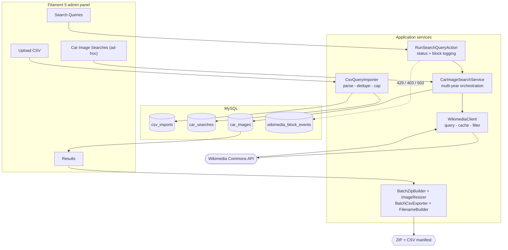

# Cars Images API

A Laravel 13 + Filament 5 application that searches, filters, reviews, and bulk-exports car photography from **Wikimedia Commons** — one vehicle at a time, or thousands of rows from a CSV.


---

## Contents

- [Overview](#overview)
- [How it works](#how-it-works)
- [Features](#features)
- [Engineering notes](#engineering-notes)
- [Tech stack](#tech-stack)
- [Getting started with Docker](#getting-started-with-docker)
- [Getting started without Docker](#getting-started-without-docker)
- [Configuration](#configuration)
- [Usage](#usage)
- [Testing](#testing)
- [Deployment](#deployment)
- [Project structure](#project-structure)
- [Roadmap](#roadmap)
- [License](#license)

---

## Overview

Sourcing usable photos for a large vehicle catalogue is tedious: every make/model/year needs its own search, Wikimedia's full-text index is inconsistent, results are frequently mis-filed or not cars at all, and the originals are far too large to ship to a website.

This application turns that into a reviewable pipeline:

1. **Import** a vehicle list (CSV) or run a single ad-hoc search.
2. **Harvest** images from Wikimedia Commons at a rate the API is happy with.
3. **Review** what came back, with off-target results flagged rather than silently trusted.
4. **Export** the approved set as a web-optimized ZIP plus a matching CSV manifest.

Every stage is inspectable in the admin panel, and nothing is thrown away without a human deciding.

---

## How it works



The two entry points share one engine. An **ad-hoc search** (`car_searches` with a null `csv_import_id`) and a **CSV-imported query** (`csv_import_id` set) are the same row type, scoped apart at the resource level, and both flow through `CarImageSearchService`.

---

## Features

### Search and harvesting

- Query Wikimedia Commons by **make, model, year range, color, transmission**, and transparent background — one API request per year in the range.
- **Linked make/model dropdowns** driven by a curated catalogue, with `All models` / `All colors` / `All transmissions` options to widen a search.
- **Result caching and reuse.** Searches persist to `car_searches`; an identical completed search reuses its stored images instead of calling Wikimedia again.
- **Year-relaxation fallback.** When a year-specific query returns nothing, it retries once without the year, so sparsely documented models still return results.
- **Non-car and non-image filtering.** Wikimedia's `File:` namespace also holds PDFs, DjVu documents, botanical photos and journal figures; these are dropped by MIME type and by a title/description/category heuristic.

### Review

- **Off-make rejection, then flagging.** Wikimedia's full-text search matches loosely — querying an `Acura CL` returns `Honda Accord CL3` photographs, because the Accord's chassis code contains the model token. Images that plainly name a *different* manufacturer are therefore rejected outright and never stored. What survives is recorded as **Confirmed / Not confirmed** against the searched make and shown as a badge with a filter, so genuinely ambiguous results still reach a human rather than being silently trusted.
- **Badge engineering is preserved.** Some Acuras are legitimately catalogued by Wikimedia under Honda. A page naming *both* makes is kept, because it really is the searched car.
- Sortable, searchable tables with thumbnails, live-polling status badges, preview modals, and per-row or bulk delete.

### Export

- **Download Selected as ZIP** — every selected image, resized and renamed.
- **Download Confirmed as ZIP** — the same, narrowed to make-confirmed images only.
- **Export Selected as CSV** — a manifest whose `Filename` column matches the ZIP entries exactly, so the archive and the spreadsheet never drift apart.
- Filenames are deterministic and filesystem-safe: `1997 Toyota RAV4.jpg`, with duplicates suffixed `1997 Toyota RAV4 2.jpg`.

### Administration

- Dedicated **Car Makes** catalogue (makes with a models repeater) that feeds the search dropdowns.
- **Admin Users** management with hashed passwords and blank-to-keep password editing.
- Wikimedia block events recorded and visible, rather than failing silently.

---

## Engineering notes

The parts of this project worth reading are the ones that exist because the obvious approach did not survive contact with the real API.

**Wikimedia rate-limit etiquette is built in, not bolted on.** Requests send a descriptive, contactable `User-Agent` (Wikimedia's UA policy rejects generic ones with 429/403), set `maxlag=5` so the app backs off when replication lags, cache for 24 hours, pause one second between bulk queries, and retry transient failures with exponential backoff. A 429/403/503 raises a typed `WikimediaBlockedException`, is persisted to `wikimedia_block_events`, and **halts the bulk loop** — the failure mode of a harvesting tool should never be to keep hammering.

**Thumbnails are generated locally because the CDN refuses.** The first implementation requested Wikimedia's `/thumb/` URLs. Those return HTTP 400 when requested from datacenter and shared-hosting IPs, so it worked in development and failed in production. The fix was to download the original and resize with GD (`ImageResizer`, default 1600px max width, JPEG re-encode) — roughly an 85% size reduction, and host-independent. Unsupported formats fall through with the original bytes intact, so an image is never lost from an archive.

**CSV model strings are normalized before querying.** Vehicle data encodes models as engine displacement plus trim (`2.2CL/3.0CL`); Wikimedia catalogues the bare model (`CL`). `ModelSearchTermNormalizer` strips the displacement prefix and collapses slash-separated variants, but keeps the original whenever stripping would leave too little to search on.

**Transmission is deliberately dropped from CSV-driven queries.** Image pages never say "Automatic 4-spd", so including it returned zero results across the board. It is kept as manifest metadata; ad-hoc searches, where the user typed it on purpose, still use it.

**Off-make results are flagged, not filtered.** Badge-engineered and region-specific models are catalogued under a different marque — an Acura CL is filed as a Honda Accord. Auto-rejecting those would throw away correct photographs of the right car; auto-accepting them hides a real data quirk. `MakeRelevanceChecker` marks the discrepancy and lets the reviewer decide.

**Synchronous work is capped rather than left to time out.** Bulk runs stop at 50 queries or 50 seconds per click and bulk ZIPs at 100 images, because both are built inside a single web request on shared hosting. Each cap is a config value with an explicit reason in `config/cars-images.php`, and the UI tells the user to click again rather than dying at the gateway timeout.

**Failure paths are explicit.** A per-image fetch failure skips that image instead of aborting the archive; an archive where everything failed reports it instead of serving a zero-entry ZIP; a search that throws is forced to `failed` even though its status update was inside the rolled-back transaction. A refresh deletes and refetches inside **one** transaction, so a rate-limited Wikimedia cannot leave a search stripped of the images it was replacing.

**One image can belong to many searches.** The same Commons file legitimately answers several queries, so ownership — `(car_search_id, year, provider, provider_image_id)` — is part of the upsert key and is enforced by a unique index. Keyed only on the file, a later search would *move* the row instead of copying it, silently emptying the earlier search.

---

## Tech stack

| Layer | Choice |
| --- | --- |
| Runtime | PHP 8.3+ (`ext-gd`, `ext-zip`, `ext-intl`, `ext-pdo_mysql`) |
| Framework | Laravel 13.x |
| Admin UI | Filament 5.x (Livewire 4) |
| Database | MySQL 8.0 |
| External API | MediaWiki / Wikimedia Commons |
| Image processing | GD |
| Local environment | Docker (Apache + mod_php + MySQL) |
| Tests | PHPUnit 12 (requires `ext-pdo_sqlite`) |

> **Currently on the latest release of every major dependency** — Laravel 13.26, Filament 5.7, Livewire 4.4, PHPUnit 12. The upgrade was executed in verified stages; the plan, compatibility matrix, per-stage gates, and the issues it surfaced are recorded in [`docs/upgrades/2026-08-24-laravel-13-filament-5-upgrade.md`](docs/upgrades/2026-08-24-laravel-13-filament-5-upgrade.md).

---

## Getting started with Docker

The Docker stack mirrors SiteGround shared hosting — Apache + mod_php + MySQL, with `file` cache/session and a `sync` queue — so routing and `.htaccess` problems surface locally instead of after deployment.

**Prerequisites:** Docker Engine 24+ and Docker Compose v2.

```bash
cp .env.example .env
# The defaults work as-is for Docker. Before harvesting, set WIKIMEDIA_USER_AGENT
# to a string identifying your deployment with a real contact address.
docker compose build
docker compose up -d
docker compose exec app composer install
docker compose exec app php artisan key:generate
docker compose exec app php artisan migrate --seed
docker compose exec app php artisan storage:link
```

The panel is then at `http://localhost:8080/admin` — change `APP_PORT` in `.env` to use a different host port.

**Notes**

- `docker compose down` keeps the `cars-mysql-data` volume; `docker compose down -v` wipes the database.
- The `app` container runs as UID/GID 1000 — override with the `WWWUSER` / `WWWGROUP` build args if your host user differs.
- Re-run `docker compose exec app composer install` after pulling changes to `composer.json` / `composer.lock`.
- MySQL is published on `${FORWARD_DB_PORT}` (default `3307`) if you want to attach a GUI client.

---

## Getting started without Docker

**Prerequisites:** PHP 8.3+ with `gd`, `zip`, `intl`, `pdo_mysql` (plus `pdo_sqlite` to run the tests), Composer, MySQL 8, and Node.js only if you intend to rebuild frontend assets.

```bash
git clone <YOUR_REPO_URL> cars-images-api
cd cars-images-api

composer install
cp .env.example .env          # set DB_HOST=127.0.0.1 and the DB_* values for your machine
php artisan key:generate
php artisan migrate --seed
php artisan storage:link
php artisan serve             # or point Laragon / Valet / nginx at public/
```

`migrate --seed` creates the Filament admin user and seeds the default make/model catalogue used by the search form.

> **Change the seeded admin password before exposing the panel.** `FilamentAdminUserSeeder` creates its account from credentials committed to this repository, and because it uses `updateOrCreate`, re-running the seeder resets that password back to the committed value.

---

## Configuration

Wikimedia integration lives in `config/images.php`; all application limits live in `config/cars-images.php`. Both are environment-driven.

| Variable | Default | Purpose |
| --- | --- | --- |
| `WIKIMEDIA_BASE_URL` | `https://commons.wikimedia.org/w/api.php` | MediaWiki API endpoint |
| `WIKIMEDIA_USER_AGENT` | — | **Set this to a real, contactable UA.** Wikimedia blocks generic agents |
| `WIKIMEDIA_TIMEOUT` | `10` | Per-request timeout (seconds) |
| `WIKIMEDIA_RETRY_TIMES` | `3` | Retry attempts for transient errors |
| `WIKIMEDIA_RETRY_SLEEP_MS` | `200` | Backoff base; doubles per attempt |
| `WIKIMEDIA_CACHE_TTL` | `3600` | Search-result cache lifetime (seconds) |
| `WIKIMEDIA_MAXLAG` | `5` | MediaWiki `maxlag` courtesy parameter |
| `CSV_IMPORT_MAX_COMBOS` | `1000` | Reject an upload above this many unique queries |
| `CSV_IMPORT_DEFAULT_IMAGES_PER_YEAR` | `5` | Images requested per imported query |
| `CARS_BULK_RUN_MAX_QUERIES` | `50` | Queries per bulk-run click |
| `CARS_BULK_RUN_MAX_SECONDS` | `50` | Wall-clock ceiling per bulk-run click |
| `CARS_BULK_RUN_SLEEP_SECONDS` | `1` | Pause between bulk queries |
| `CARS_DOWNLOAD_MAX_WIDTH` | `1600` | Max width for ZIP images (resized locally) |
| `CARS_DOWNLOAD_JPEG_QUALITY` | `82` | JPEG quality for resized images |
| `CARS_BULK_DOWNLOAD_MAX_IMAGES` | `100` | Max images per synchronous ZIP |

---

## Usage

### CSV bulk pipeline

The three pages under the **Cars** navigation group run left to right.

**1. Upload CSV** (`/admin/csv-imports/create`)

Required columns are `Make`, `Model`, `Year`; `Transmission` is optional and carried through to the manifest. Rows are deduplicated by `(Year, Make, Model)`, rows with a missing field or an implausible year are skipped and counted, and an upload producing more than `CSV_IMPORT_MAX_COMBOS` unique queries is rejected outright rather than half-imported.

```csv
Make,Model,Year,Transmission
Toyota,RAV4,1997,Automatic 4-spd
Acura,2.2CL/3.0CL,1998,Manual 5-spd
```

**2. Search Queries** (`/admin/search-queries`)

Review the imported queries, then **Run** a single row or select many and **Run Selected**. Bulk runs process up to `CARS_BULK_RUN_MAX_QUERIES` queries or `CARS_BULK_RUN_MAX_SECONDS` seconds per click — click again to continue. A Wikimedia block pauses the run, raises a persistent notification, and records the event.

**3. Results** (`/admin/results`)

Browse the harvested images, filter by source CSV or by **Make match**, then export the selection as a ZIP, a confirmed-only ZIP, or a CSV manifest.

### Ad-hoc search

**Cars → Car Image Searches → Create.** Pick a make (the model list follows it), set a year range — reversed ranges are normalized — and optionally a color, transmission, or transparent-background toggle. The search runs synchronously and redirects to its view page, where the **Images** relation holds the results.

From that view page, **Refresh from Wikimedia** deletes the search's images, clears the cached responses for its years, and re-runs with the current filters. Editing the search instead re-runs it with the *new* filters.

### Catalogue and users

**Cars → Car Makes** manages makes and their models (used by the search dropdowns; built-in defaults apply when the tables are empty). **System → Admin Users** manages panel accounts — leave the password blank when editing to keep the existing one.

---

## Testing

```bash
php artisan test                        # whole suite
php artisan test --testsuite=Unit       # fast, no database
php artisan test --filter=BatchZipBuilder
```

124 tests across 26 files: 41 unit tests over the pure helpers (filename building, image resizing, make relevance and off-make rejection, model normalization) and 83 feature tests over the CSV importer, ZIP/CSV export, Wikimedia block handling and recall fallback, resource scoping, off-make filtering, the Results page bulk actions, a smoke test that mounts **every** page in the panel, the registered record/bulk actions on every table, the CSV upload driven through the Filament form itself, and the ad-hoc search form's `All ...` sentinel round-trip.

The last three exist as upgrade insurance, and they earned it: they carried this codebase through Laravel 12→13 and Filament 4→5 (Livewire 3→4) with no behavioural regressions. A major release typically breaks an application by renaming a builder method, which leaves the resource compiling but the page throwing on mount — `PanelSmokeTest` turns that into a failing test rather than a support ticket, and `TableActionsTest` catches the subtler case where a page still renders but has quietly lost its buttons.

> Feature tests run against an in-memory SQLite database (see `phpunit.xml`), so **`ext-pdo_sqlite` must be installed** — without it every database-backed test errors with `could not find driver` while the unit tests still pass.

Code style is enforced with Pint:

```bash
./vendor/bin/pint --test    # check
./vendor/bin/pint           # fix
```

---

## Deployment

`DEPLOYMENT.md` covers deployment to SiteGround shared hosting in detail: directory layout, serving Laravel from `public/`, the `.htaccess` rewrite that keeps `/livewire/livewire.js` reachable, environment configuration, and troubleshooting. The Docker stack above deliberately mirrors that environment.

---

## Project structure

```
app/
├── Exceptions/          WikimediaBlockedException — typed rate-limit signal
├── Filament/
│   ├── Pages/           Results (bulk export surface)
│   └── Resources/       CsvImport, SearchQuery, CarSearch, CarImage, CarMake, User
├── Http/Controllers/    Single-image authenticated download endpoint
├── Jobs/                Queue scaffolding (not dispatched yet — see Roadmap)
├── Models/              CarSearch, CarImage, CsvImport, CarMake, CarModel, WikimediaBlockEvent, User
└── Services/
    ├── Downloads/       BatchZipBuilder, BatchCsvExporter, ImageResizer, FilenameBuilder
    ├── Images/          WikimediaClient, CarImageSearchService, MakeRelevanceChecker, ModelSearchTermNormalizer
    ├── Imports/         CsvQueryImporter
    └── Search/          RunSearchQueryAction
config/
├── cars-images.php      Import caps, bulk-run pacing, download sizing
└── images.php           Wikimedia client settings
docs/                    Design specs and implementation plans per feature
tests/{Unit,Feature}/    Mirrors the app/ layout
```

Background on the original design and decision history lives in `PLAN.md`, `CHAT.md`, and `docs/`.

---

## Roadmap

- Move bulk search and bulk download onto a queue worker, retiring the synchronous caps (`app/Jobs/` holds the scaffolding).
- Persist exports to the `cars` storage disk instead of streaming them straight to the browser.
- Add a CI pipeline running Pint and PHPUnit against MySQL.
- Replace the keyword-based non-car heuristic with AI-assisted classification for ambiguous results (see `PLAN.md`).

---

## License

No license file ships with this repository; the underlying Laravel skeleton it was generated from is MIT-licensed. Images retrieved through this tool remain subject to their individual Wikimedia Commons licences, which are stored per image in the `license` and `attribution` columns.
